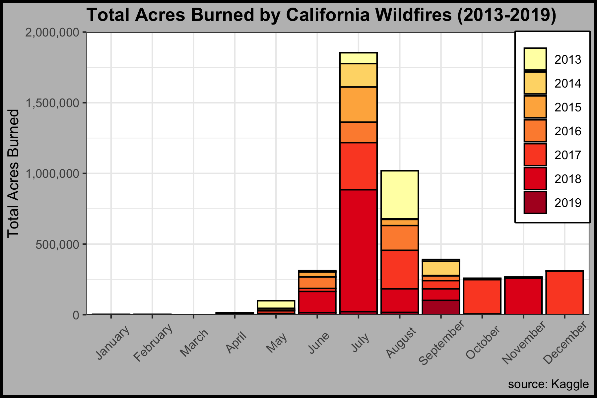
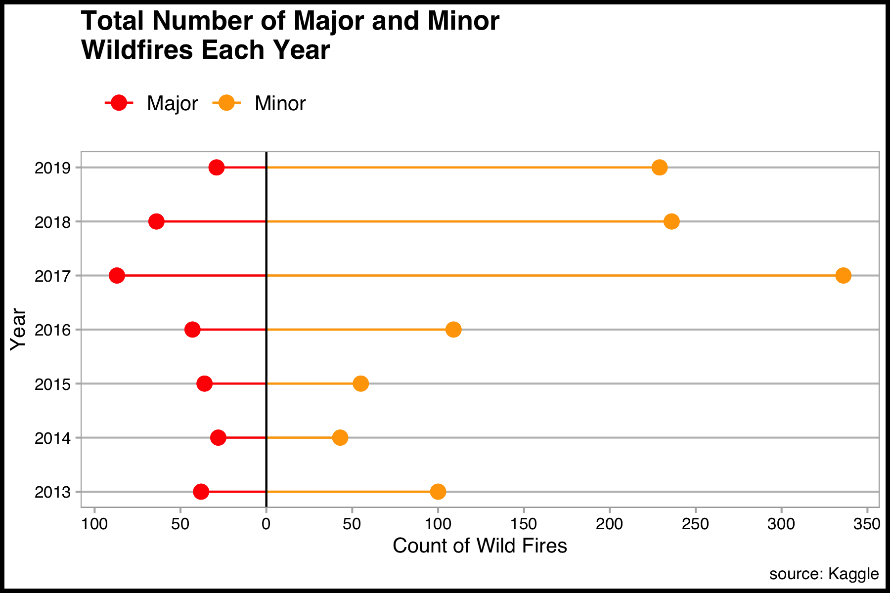
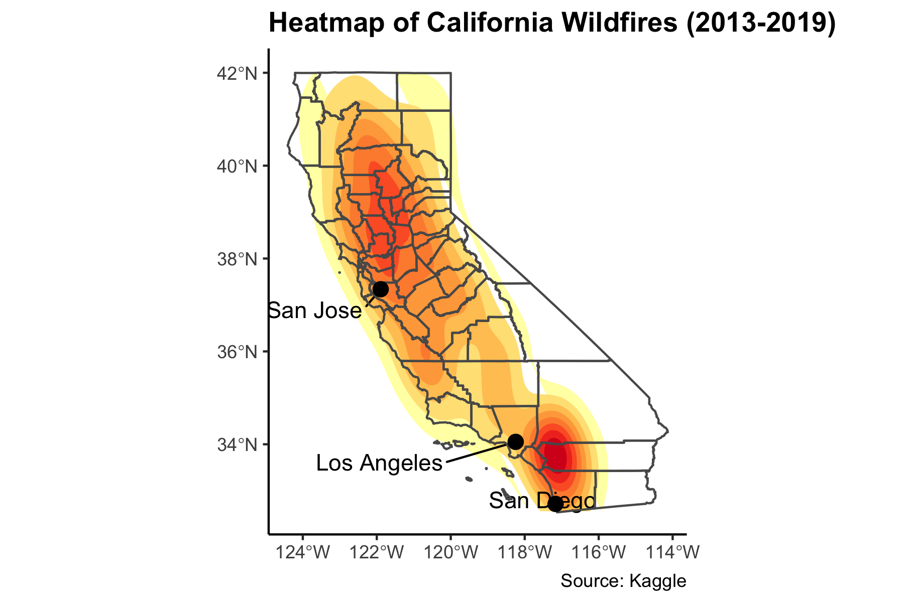

```{r setup, include=FALSE}
knitr::opts_chunk$set(echo = FALSE)
```

```{r message=FALSE, warning=FALSE}
library(knitr)
library(dplyr)
```


# Introduction
<br>
In recent decades the number, severity and overall size of wildfires has increased across much of the U.S. In fact, the 2018 wildfire season in California recorded the largest fire in acres burned (see figure \@ref(fig:plot-stack)). Apart from the acres burned many fires in recent years had high levels of severity (see figure \@ref(fig:plot-loli)) causing massive destruction in property and deaths in the state of California.
<br>
<br>
This project aims to viszualize the fires in the area and help both the residents and the Forest Service to identify patterns and areas of most risk in order to plan appropriately.
<br>
<br>
<br>
<br>
<br>
<br>
<br>
<br>
<br>
<br>

# Total Acres Burned
<br>
Wildfire season has become longer based on conditions that allow fires to start and to burn—winter snows are melting earlier and rain is coming later in the fall. What was once a four-month fire season now lasts six to eight months. For example, figure \@ref(fig:plot-stack) shows fires in recent years have burned well outside of the typical fire season throughout California. Fires in the winter months are becoming part of the norm.

```{r plot-stack, fig.cap= "Plot of total acres burned by California Wildfires in 2013-2019 by month.", fig.align = "center"}

```
<br>
<br>
<br>
<br>
<br>
<br>
<br>
<br>
<br>

# Severity of Wildfires
<br>
According to figure \@ref(fig:plot-loli), there is a clear trend where from 2017 onward the number of fires seemed to have greatly increased. The year of 2017 had the most total reported fires in California. It was also the year with the highest amount of major fires. Despite being the year with the most acres burned, 2018 was the second in number of fires and number of major fires. This means that fires in 2018 were most intense or larger causing more destruction than the fires in 2017. 


```{r plot-loli, fig.cap= "Plot of total number major and minor wildfires in California between 2013-2019.", fig.align = "center"}

```


# Fire Locations
<br>
Although fires occur across California, Figure \@ref(fig:plot-map) below shows that San Jose, Los Angles, San Diego were the most common locations for fires in 2013-2019. It must a priority for the Forest Service to work with state and local agencies in mutual aid and to reduce risk to these areas. 

```{r plot-map, fig.cap= "Heatmap showing areaes with higher frequence of wildfires in California between 2013-2019.", fig.align = "center"}

```

<br>
<br>
<br>
<br>

# Conclusion
<br>
Forest Service crews must plan for wildfire year-round (figure \@ref(fig:plot-stack)). Despite the first 3 months being calmer, with the number of fires increasing every year the data shows that it isn’t a matter of if there will be a fire, but when. Forest Service crews already proactively pursue fuel reduction treatments like mechanical thinning and prescribed fires. When conditions are favorable, options such as these reduce the risk of catastrophic wildfires. Even in a year like this, which has been unusually wet and cool, fire managers sould still see opportunities to prepare for wildfires. 

Residents who live in fire-prone areas such as  San Jose, Los Angles, San Diego (figure \@ref(fig:plot-map)) must also plan and live in fire adapted communities. Defensible space, structure hardening and family plans for a possible evacuation, including pets, should be part of living in the wildland-urban interface. Nearly 90% of wildfires are human-caused, so preventing wildfire is important.


# References
<br>
Schweizer, Posted by Deb, Ed Dunn, Ray, and Michael Wilkins. “Wildfires in All Seasons?” USDA, July 29, 2021. https://www.usda.gov/media/blog/2019/06/27/wildfires-all-seasons. 

“List of California Wildfires.” Wikipedia. Wikimedia Foundation, March 30, 2022. https://en.wikipedia.org/wiki/List_of_California_wildfires. 
